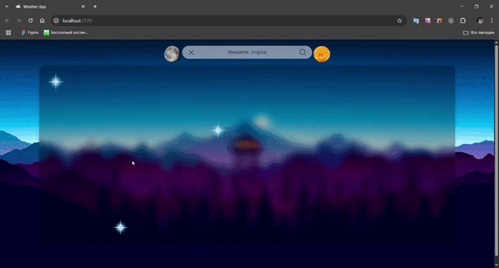

# WeatherApp 🌤️

**WeatherApp** — это веб-приложение для просмотра текущей погоды в любом городе мира. Интерфейс прост и удобен, а данные обновляются в реальном времени. 🕒

***

## 🚀 Возможности

- 🔍 Поиск погоды по названию города
- 📆 Прогноз на 2 дня вперёд
-  🌡️ Температура, влажность и облачность за окном
- 🌐 Данные обновляются в реальном времени
  
***

## 🛠️ Технологии
<p align="left">
<a href="https://developer.mozilla.org/en-US/docs/Web/JavaScript" target="_blank" rel="noreferrer"></a>
<a href="https://developer.mozilla.org/en-US/docs/Glossary/HTML5" target="_blank" rel="noreferrer"></a>
<a href="https://reactjs.org/" target="_blank" rel="noreferrer"></a>
<a href="https://www.w3.org/TR/CSS/#css" target="_blank" rel="noreferrer"></a>
<a href="https://vitejs.dev/" target="_blank" rel="noreferrer"></a>
<a href="https://www.weatherapi.com/" target="_blank" rel="noreferrer"></a>
</p>

***
## 📦 Установка и запуск

Следуйте этим шагам, чтобы запустить проект локально:

1. **Клонируйте репозиторий:**

   ```bash
   git clone https://github.com/kirillxxn/weatherapp.git
   cd weatherapp
   ```
2. **Установите зависимости:**

   ```bash
    npm i
   ```
3. **Создайте .env файл в корне проекта:**

   ```env
    VITE_WEATHER_API_KEY=ваш_api_ключ
   ```
4. **Запустите проект в режиме разработки:**

   ```bash
    npm run dev
   ```
5. **Откройте приложение в браузере:**

   ```Перейдите по адресу:
    http://localhost:5173
   ```
***

## 🔗 Пример запроса к API

Чтобы сделать запрос к  API, воспользуйтесь следующим примером:
  ```bash
https://api.weatherapi.com/v1/forecast.json?key=Ваш_Ключ&q=Ваш_Город&days=2&aqi=no&alerts=no
```

***

## 📸 Пример работы проекта
  <div align="center">
      
    </div>
